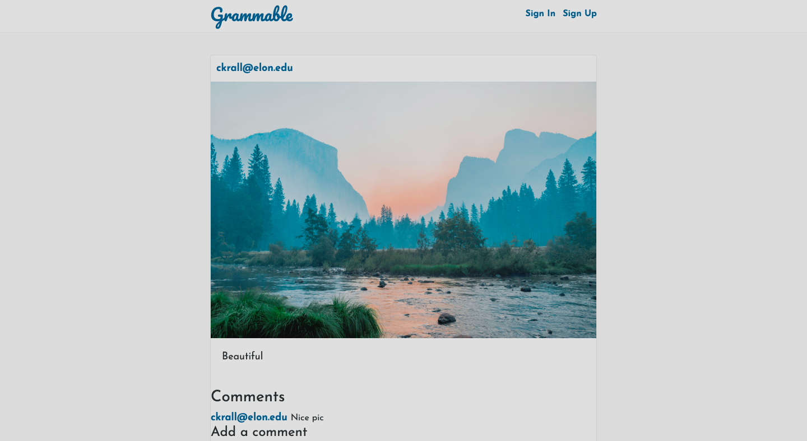

# Grammable

This is an Instagram clone for users to post photos and comment on others photos. This was created to use test-driven development(Rspec). It was built using Ruby on Rails. User authentication was enabled by Devise. PostgreSQL was used for database management. Bootstrap was used for design.

Visitors must sign up to make a post and/or comment on other posts.

## Click [here](https://grammable-conner-krall.herokuapp.com/) to view.

This is the home page:

## Tools & Resources

* [Ruby on Rails](https://rubyonrails.org/) 
* [PostgreSQL](https://www.postgresql.org/)
* [Bootstrap](https://getbootstrap.com/)
* [Devise](https://github.com/plataformatec/devise/)
* [RSpec](https://github.com/rspec/rspec-rails/)